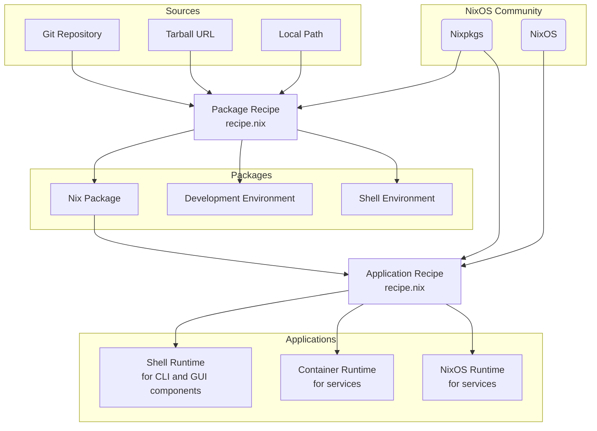

[](https://github.com/ngi-nix/forge/actions/workflows/nixpkgs-build-status.yml)

# NGI Forge

This software is in active development. Expect backwards incompatible changes.

## Features

- Simple, type checked configuration recipes for **packages** and
  **multi-component applications** using
  [module system](https://nix.dev/tutorials/module-system/index.html)

- [Web UI](https://ngi-nix.github.io/forge)

- Easy [self hosting](#self-hosting)

### Conceptual diagram



## Self hosting

- Initiate new Nix Forge instance from template

```bash
nix flake init --template github:ngi-nix/forge#provider
```

- Set `repositoryUrl` attribute in `flake.nix` to your repository

- Add all new files to git

- Start creating recipes in `recipes` directory

## Credits

This software was originally started as a fork of
[imincik/nix-forge](https://github.com/imincik/nix-forge).
